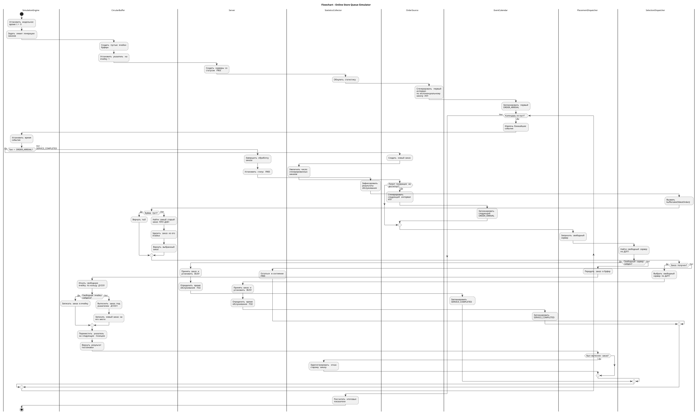

# Первичные артефакты — центр обработки заказов интернет-магазина

**Вариант № 1. Этап подготовки к 16 октября 2026 года.**

> Это пока не законченная страница.

## Документы

- [Бизнес-домен](business-domain.md)
- [Маппинг элементов СМО](mapping.md)

## Планируемые диаграммы

- `diagrams/sequence.puml` — одна большая диаграмма последовательности, включая HappyFlow, переполнение и Д1ОО1.
- `diagrams/classes.puml` — UML-диаграмма классов со связями и методами.
- `diagrams/flowchart.puml` — flowchart с дорожками и альтернативами.

**Расшифровка варианта:** `ИБ — ИЗ1 — ПЗ2 — Д1ОЗ1 — Д1ОО1 — Д2П1 — Д2Б1 — ОР2 — ОД1`.

# Первичные артефакты

## 1. Flowchart — алгоритм работы СМО

Диаграмма описывает работу центра обработки заказов
интернет-магазина в соответствии с вариантом № 1.

Моделирование осуществляется методом особых событий.

На диаграмме представлены:
- генерация и поступление заказов;
- выбор свободного сервера;
- кольцевая буферизация Д1ОЗ1;
- вытеснение заявок Д1ОО1;
- выбор по FIFO Д2Б1;
- завершение обслуживания;
- сбор статистики.

### Диаграмма с дорожками (Swimlanes)

[Исходный код диаграммы](diagrams/flowchart.puml)
