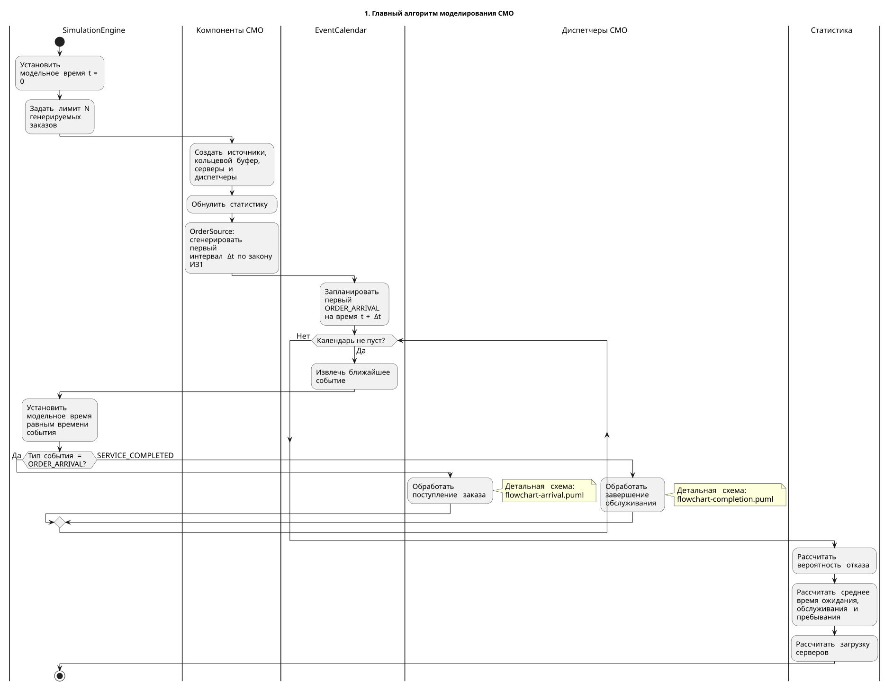
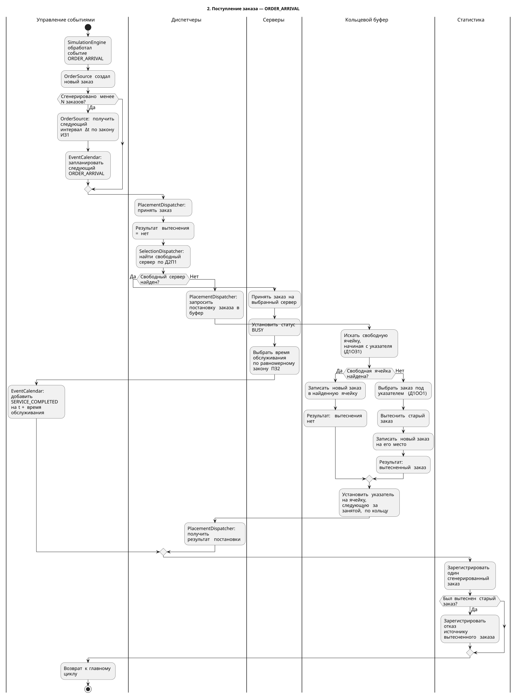
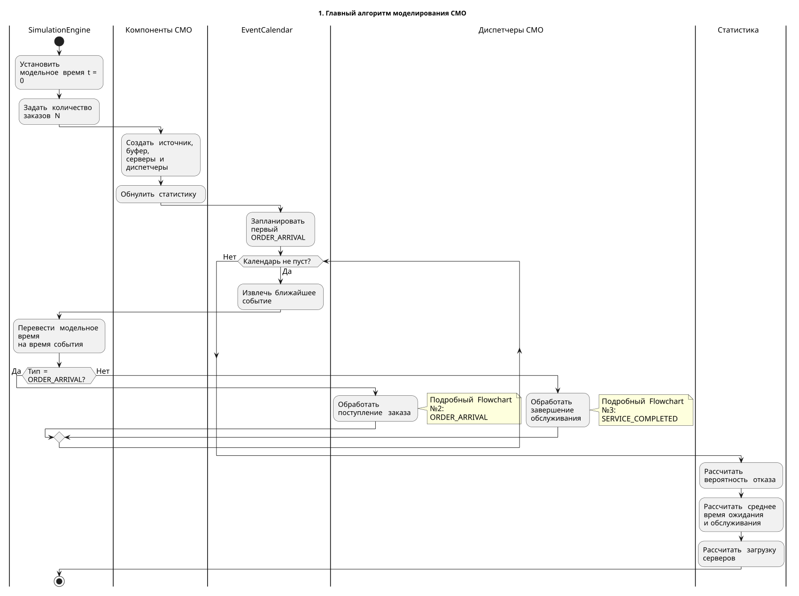
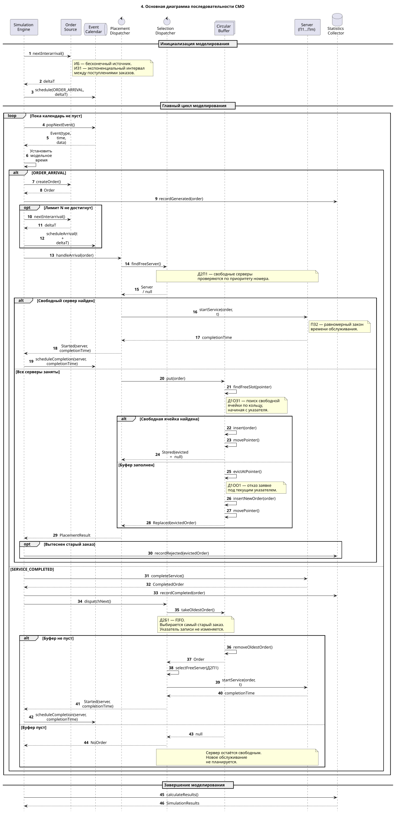
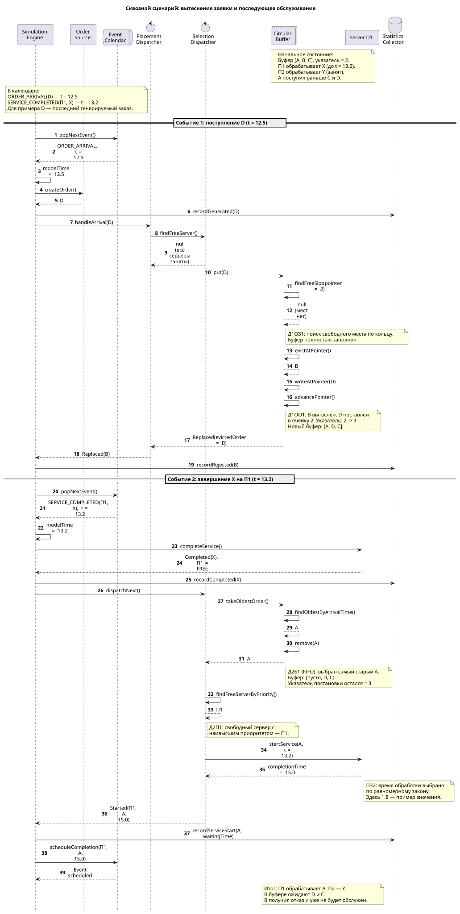
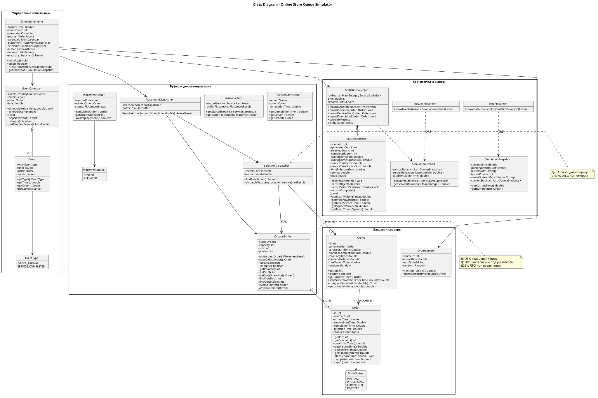

# Первичные артефакты — Центр обработки заказов интернет-магазина

**Автор:** Троян Дмитрий Максимович  
**Группа:** 5130904/40101  
**Вариант СМО:** № 1  
**Бизнес-домен:** Центр обработки заказов интернет-магазина

## Содержание

1. [Описание проекта](#1-описание-проекта)
2. [Формула и расшифровка варианта](#2-формула-и-расшифровка-варианта)
3. [Компоненты и принципы моделирования](#3-компоненты-и-принципы-моделирования)
4. [Flowchart — диаграммы процессов](#4-flowchart--диаграммы-процессов)
   - [4.1. Главный алгоритм](#41-главный-алгоритм-моделирования)
   - [4.2. Поступление заказа](#42-поступление-заказа--order_arrival)
   - [4.3. Завершение обслуживания](#43-завершение-обслуживания--service_completed)
5. [Правила работы и граничные случаи](#5-правила-работы-и-граничные-случаи)
6. [Sequence Diagram — диаграммы последовательности](#6-sequence-diagram--диаграммы-последовательности)
   - [6.1. Основная диаграмма последовательности](#61-основная-диаграмма-последовательности)
   - [6.2. Сквозной сценарий вытеснения и обслуживания](#62-сквозной-сценарий-вытеснения-и-обслуживания)
7. [Class Diagram — диаграмма классов](#7-class-diagram--диаграмма-классов)
8. [Следующие этапы](#8-следующие-этапы)

---

## 1. Описание проекта

Проект представляет собой имитационную модель **автоматизированного центра обработки заказов интернет-магазина**, рассматриваемого как система массового обслуживания (СМО).

Клиенты оформляют заказы через веб-сайт или мобильное приложение. Заказы поступают в систему, после чего передаются вычислительным серверам. Если все серверы заняты, заявки ожидают обслуживания в кольцевом буфере ограниченной ёмкости. При заполнении буфера применяется дисциплина отказа **Д1ОО1 — вытеснение заявки под указателем**.

Цель моделирования — исследовать поведение системы при различных параметрах входного потока, буфера и серверов, включая вероятность отказа, длительность ожидания и загрузку вычислительных ресурсов.

**Исходные документы:**

- [Бизнес-домен](business-domain.md)
- [Маппинг элементов СМО](mapping.md)

## 2. Формула и расшифровка варианта

**Формула варианта № 1:** `ИБ ИЗ1 ПЗ2 Д1ОЗ1 Д1ОО1 Д2П1 Д2Б1 ОР2 ОД1`

| Код | Дисциплина / характеристика | Отображение в интернет-магазине |
| --- | --- | --- |
| **ИБ** | Бесконечный источник | Поток заказов от клиентов, не зависящий от завершения предыдущих заказов |
| **ИЗ1** | Пуассоновский поток заявок | Время между поступлениями заказов имеет экспоненциальное распределение |
| **ПЗ2** | Равномерное распределение времени обслуживания | Время обработки заказа сервером выбирается по равномерному закону |
| **Д1ОЗ1** | Постановка в буфер по кольцу | Свободная ячейка ищется начиная с указателя с переходом от конца к началу |
| **Д1ОО1** | Отказ под указателем | При переполнении заказ под указателем вытесняется новым заказом |
| **Д2П1** | Выбор прибора по приоритету номера | Выбирается свободный сервер с наивысшим приоритетом по номеру |
| **Д2Б1** | FIFO | Из буфера извлекается заказ, поступивший раньше остальных |
| **ОР2** | Графики результатов | В автоматическом режиме строятся графики исследуемых показателей |
| **ОД1** | Календарь событий, буфер и состояние системы | В пошаговом режиме отображаются события, содержимое буфера и состояния серверов |

## 3. Компоненты и принципы моделирования

Модель использует **метод особых событий (Discrete-Event Simulation)**. Модельное время переходит непосредственно к моменту ближайшего запланированного события; постоянный опрос серверов на каждом временном шаге не требуется.

Основные типы событий:

- `ORDER_ARRIVAL` — поступление нового заказа;
- `SERVICE_COMPLETED` — завершение обработки заказа на сервере.

Предварительное распределение ответственности между компонентами:

| Компонент | Назначение |
| --- | --- |
| `SimulationEngine` | Управляет модельным временем и циклом обработки событий |
| `EventCalendar` | Хранит запланированные события и выдаёт ближайшее |
| `OrderSource` | Создаёт заказы и определяет интервалы поступления согласно ИЗ1 |
| `PlacementDispatcher` | Организует приём и постановку нового заказа |
| `SelectionDispatcher` | Организует выбор свободного сервера (Д2П1) и заявки из буфера (Д2Б1) |
| `CircularBuffer` | Хранит ожидающие заказы, управляет ячейками и указателем, выполняет вытеснение |
| `Server` | Обслуживает заказ и хранит собственное состояние занятости |
| `StatisticsCollector` | Регистрирует поступления, отказы, времена ожидания и обслуживания, загрузку серверов |

Предполагается возможность **прямой передачи заказа свободному серверу без промежуточной записи в буфер**, как описано в бизнес-домене. Если все серверы заняты, новый заказ направляется в кольцевой буфер.

## 4. Flowchart — диаграммы процессов

Алгоритм работы системы разделён на **три связанные UML Activity Diagram с дорожками (Swimlanes)**. Это позволяет отдельно показать общий цикл и подробные альтернативы обработки событий без потери читаемости.

Каждое изображение можно нажать для открытия в полном размере. Под изображением приведена ссылка на редактируемый исходник PlantUML.

### 4.1. Главный алгоритм моделирования

Главная диаграмма показывает инициализацию компонентов СМО, генерацию времени первого события согласно ИЗ1 и цикл обработки календаря. На каждой итерации `SimulationEngine` извлекает ближайшее событие, обновляет модельное время и вызывает соответствующий сценарий.

Генерация заказов ограничивается заданным числом `N`. После поступления последнего заказа новые `ORDER_ARRIVAL` не планируются, но события завершения обслуживания оставшихся заказов продолжают обрабатываться. После опустошения календаря рассчитывается итоговая статистика.

**Материалы:** [Открыть SVG в полном размере](diagrams/flowchart_main.svg) · [Исходный код PlantUML](diagrams/flowchart-main.puml)

---

### 4.2. Поступление заказа — ORDER_ARRIVAL

Диаграмма описывает обработку одного нового заказа. При поступлении заявки фиксируется факт генерации и, пока не достигнут лимит `N`, планируется следующее поступление.

Возможны три сценария:

1. **Свободный сервер найден.** Диспетчер выбирает сервер по Д2П1. Заказ передаётся на обработку без ожидания в буфере; время обслуживания определяется по ПЗ2, а в календарь добавляется `SERVICE_COMPLETED`.
2. **Все серверы заняты, в буфере есть место.** Буфер ищет свободную ячейку по кольцу (Д1ОЗ1), размещает новый заказ и перемещает указатель на следующую позицию.
3. **Все серверы заняты, буфер заполнен.** Буфер вытесняет заказ под указателем (Д1ОО1), записывает новый заказ на его место и перемещает указатель. Отказ регистрируется для **вытесненного**, а не для вновь поступившего заказа.

**Материалы:** [Открыть SVG в полном размере](diagrams/flowchart_arrival.svg) · [Исходный код PlantUML](diagrams/flowchart-arrival.puml)

---

### 4.3. Завершение обслуживания — SERVICE_COMPLETED

Диаграмма показывает обработку события освобождения сервера. Сначала фиксируется завершение заказа и собирается статистика. Затем `SelectionDispatcher` запрашивает у `CircularBuffer` самый старый ожидающий заказ через метод `takeOldestOrder()`.

Возможны два сценария:

1. **Буфер не пуст.** Буфер выбирает и удаляет самый старый заказ по FIFO (Д2Б1) и возвращает его диспетчеру. Диспетчер выбирает свободный сервер согласно Д2П1. Для начатого обслуживания определяется длительность по ПЗ2 и планируется новое `SERVICE_COMPLETED`.
2. **Буфер пуст.** Метод возвращает `null`; свободный сервер не получает нового заказа, и дополнительное событие завершения не создаётся.

Извлечение заказа по FIFO **не изменяет указатель постановки** в кольцевой буфер.

**Материалы:** [Открыть SVG в полном размере](diagrams/flowchart_completion.svg) · [Исходный код PlantUML](diagrams/flowchart-completion.puml)

---

## 5. Правила работы и граничные случаи

- **Кольцевой указатель (Д1ОЗ1)** определяет, с какой позиции начинается поиск свободной ячейки. После записи заказа он перемещается на позицию, следующую за занятой, с переходом к началу после последней ячейки.
- **Переполнение (Д1ОО1)** возникает при поступлении нового заказа, когда все серверы заняты и свободных мест в буфере нет. Вытесненный заказ учитывается как отказ.
- **FIFO (Д2Б1)** учитывает порядок поступления заказов, а не номера ячеек буфера. Удаление заказа не требует сдвига остальных ячеек и не изменяет указатель записи.
- **Свободные серверы (Д2П1)** выбираются по приоритету номера. Если серверов, готовых принять заказ, нет, заказ поступает в буфер.
- **Пустой буфер** не блокирует работу диспетчера: `takeOldestOrder()` возвращает отсутствие заказа.
- **Завершение моделирования:** после достижения лимита генерации продолжается обработка уже поступивших заявок до выхода всех из системы.

В итоговой программе должны поддерживаться показатели по каждому источнику: количество сгенерированных заявок, вероятность отказа, среднее время ожидания, обслуживания и пребывания в системе, дисперсии времени ожидания и обслуживания; по каждому серверу — коэффициент использования.

## 6. Sequence Diagram — диаграммы последовательности

Диаграммы последовательности показывают **взаимодействия компонентов во времени**: кто инициирует операцию, какой метод вызывается, какой результат возвращается и что происходит при различных состояниях системы.

В отличие от Flowchart, здесь используются линии жизни участников, сплошные стрелки вызовов, пунктирные стрелки ответов и комбинированные фрагменты `loop`, `alt`, `opt`.

Мы подготовили две взаимодополняющие диаграммы: общую, содержащую альтернативные сценарии, и конкретный сквозной пример вытеснения заявки с последующим обслуживанием.

### 6.1. Основная диаграмма последовательности

Основной сиквенс демонстрирует взаимодействие `SimulationEngine`, `OrderSource`, `EventCalendar`, `PlacementDispatcher`, `SelectionDispatcher`, `CircularBuffer`, `Server` и `StatisticsCollector`.

Внутри **цикла обработки особых событий** предусмотрены две ветки:

**`ORDER_ARRIVAL` — поступление заявки:**

1. `SimulationEngine` получает из календаря ближайшее событие и создаёт заказ через `OrderSource`.
2. Система регистрирует поступление и при необходимости планирует генерацию следующей заявки согласно **ИЗ1**.
3. `PlacementDispatcher` запрашивает поиск свободного прибора через `SelectionDispatcher` по правилу **Д2П1**.
4. Если прибор найден, начинается обслуживание по **ПЗ2** (Happy Flow), а календарь получает новое событие `SERVICE_COMPLETED`.
5. Если приборов нет, диспетчер передаёт заказ в `CircularBuffer`: выполняется поиск свободной ячейки по **Д1ОЗ1**, либо при переполнении вытеснение по **Д1ОО1**.
6. Результат постановки возвращается диспетчеру. Если старый заказ вытеснен, это регистрируется как отказ.

**`SERVICE_COMPLETED` — завершение обслуживания:**

1. Сервер завершает обработку, система фиксирует результат и освобождает сервер.
2. `SelectionDispatcher` запрашивает у буфера следующий заказ через `takeOldestOrder()`.
3. При наличии ожидающих заказов `CircularBuffer` выбирает самый старый по **Д2Б1 (FIFO)** и возвращает его диспетчеру.
4. Для выбранного заказа назначается свободный сервер по **Д2П1** и планируется время завершения нового обслуживания.
5. Если буфер пуст, возвращается `null` и сервер остаётся свободным.

**Материалы:** [Открыть SVG в полном размере](diagrams/sequence_main.svg) · [Исходный код PlantUML](diagrams/sequence-main.puml)

---

### 6.2. Сквозной сценарий вытеснения и обслуживания

Сквозная диаграмма детализирует **две последовательные операции**: поступление нового заказа в заполненный буфер и освобождение сервера с последующей передачей ожидающего заказа на обслуживание.

**Начальное состояние:** сервер П1 обрабатывает заказ X до модельного времени `t = 13.2`, сервер П2 занят заказом Y. Буфер содержит `[A, B, C]`; указатель записи расположен на позиции 2. Заказ A поступил раньше C и D.

**Событие 1 — `ORDER_ARRIVAL(D)` при `t = 12.5`:**

1. Поступает заказ D, а свободных серверов нет.
2. Буфер заполнен; при поиске по **Д1ОЗ1** свободное место не найдено.
3. По **Д1ОО1** вытесняется заказ B, находящийся под указателем.
4. Заказ D записывается на его место; буфер становится `[A, D, C]`, указатель перемещается с позиции 2 на 3.
5. `StatisticsCollector` регистрирует отказ заказу B. B больше не будет обрабатываться.

**Событие 2 — `SERVICE_COMPLETED(П1, X)` при `t = 13.2`:**

1. Сервер П1 завершает обработку X и освобождается.
2. Диспетчер вызывает `takeOldestOrder()`; по **Д2Б1 (FIFO)** буфер возвращает A.
3. Заказ A удаляется из первой ячейки; буфер принимает состояние `[—, D, C]`. Указатель записи остаётся на позиции 3.
4. Диспетчер выбирает П1 по **Д2П1**, запускает обслуживание A и планирует новое завершение на `t = 15.0` (для примера время обслуживания составляет 1.8 единицы модельного времени по **ПЗ2**).

**Итог:** П1 обрабатывает A, П2 продолжает обрабатывать Y, заказы D и C остаются в буфере, а B получил отказ.

**Материалы:** [Открыть SVG в полном размере](diagrams/sequence_overflow.svg) · [Исходный код PlantUML](diagrams/sequence-overflow.puml)

---

## 7. Class Diagram — диаграмма классов

Диаграмма классов описывает **проектируемую объектную архитектуру имитационной модели**: состав классов и перечислений, их поля, публичные и приватные методы, а также основные связи между объектами.

Для сохранения читаемости используется **одна компактная Class Diagram**, включающая 18 классов и 3 перечисления (`OrderStatus`, `PlacementStatus`, `EventType`). Не все вспомогательные зависимости продублированы отдельными стрелками: часть из них отражена типами полей и параметров методов. Это не меняет ответственность компонентов.

### 7.1. Структура диаграммы

| Группа | Основные классы | Ответственность |
| --- | --- | --- |
| **Заказы и серверы** | `Order`, `OrderSource`, `Server` | Создание заявок (ИБ, ИЗ1), жизненный цикл заказа, обслуживание с равномерной длительностью (ПЗ2) |
| **Буфер и диспетчеризация** | `CircularBuffer`, `PlacementResult`, `PlacementDispatcher`, `SelectionDispatcher`, `ArrivalResult`, `ServiceStartResult` | Кольцевая постановка (Д1ОЗ1), вытеснение (Д1ОО1), выбор сервера по приоритету (Д2П1), извлечение по FIFO (Д2Б1) |
| **Управление событиями** | `Event`, `EventCalendar`, `SimulationEngine` | Хранение и обработка `ORDER_ARRIVAL` и `SERVICE_COMPLETED`, управление модельным временем |
| **Статистика и вывод** | `StatisticsCollector`, `SourceStatistics`, `SimulationResults`, `SimulationSnapshot`, `ResultsPresenter`, `StepPresenter` | Сбор показателей, графики автоматического режима (ОР2), снимок состояния для пошагового режима (ОД1) |

### 7.2. Основные архитектурные решения

**Инкапсуляция буфера.** `CircularBuffer` хранит приватные `slots`, `capacity`, `size`, `pointer`. Диспетчеры не изменяют содержимое массива непосредственно: постановка выполняется через `put(order)`, а выбор следующего ожидающего заказа — через `takeOldestOrder()`. Перемещение указателя выполняется внутри буфера; при извлечении по FIFO указатель не меняется.

**Разделение диспетчеризации.** `PlacementDispatcher` обрабатывает новый заказ и обращается к `SelectionDispatcher.findFreeServer()`. Если свободный сервер найден, заказ передаётся на обслуживание; иначе вызывается `CircularBuffer.put(order)`. После освобождения сервера `SelectionDispatcher.dispatchNext(time)` получает старейшую заявку из буфера и назначает свободный сервер с наивысшим приоритетом.

**Результаты операций.** `PlacementResult` содержит позицию вставки и ссылку на вытесненный заказ (если было вытеснение). `ArrivalResult` и `ServiceStartResult` позволяют передать `SimulationEngine` сведения о размещении либо начатом обслуживании без доступа к внутренним полям диспетчеров.

**Состояния и статистика.** У `Order` хранятся моменты поступления, начала обслуживания, завершения и отказа, а также статус. `Server` определяет занятость по наличию `currentOrder` и накапливает `totalBusyTime`. `StatisticsCollector` регистрирует события и рассчитывает показатели, используя `SourceStatistics`.

**Режимы вывода.** `ResultsPresenter` отображает результаты и графики ОР2, а `StepPresenter` показывает `SimulationSnapshot`: модельное время, запланированные события, буфер, указатель, состояния серверов и текущую статистику (ОД1).

### 7.3. Компактная диаграмма классов

**Материалы:** [Открыть SVG в полном размере](diagrams/class_diagram.svg) · [Исходный код PlantUML](diagrams/class_diagram_compact.puml)

---

## 8. Следующие этапы

Все **шесть UML-диаграмм** подготовлены: три Flowchart, две Sequence Diagram и одна Class Diagram. Перед фиксацией первичных артефактов и переходом к реализации необходимо:

1. **Согласовать сигнатуры методов** в Class Diagram и обеих Sequence Diagram. В частности, в диаграмме классов методы `createOrder(time)`, `handleArrival(order, time)`, `dispatchNext(time)`, `completeService(time)` и `calculateResults(time, servers)` содержат параметры, не полностью отражённые в предыдущих сиквенсах.
2. **Уточнить сбор статистики в Sequence Diagram:** при каждом начале обслуживания должен регистрироваться старт (`recordServiceStart`), а после вытеснения — отказ старому заказу (`recordRejected`).
3. **Проверить переходы состояний:** занятый сервер не вызывает отказ сам по себе; отказ происходит только при вытеснении из полного буфера. После генерации `N` заказов система продолжает обрабатывать оставшиеся события до опустошения календаря.
4. **Проверить GitHub:** загрузить SVG и исходники `.puml` в `docs/diagrams/`, убедиться, что все ссылки в этом документе открываются и изображения читаемы.
5. После проверки начать реализацию на Java, подготовить режимы ОД1 и ОР2, статистические эксперименты и отчёт.

> **Имена изображений:** во всех ссылках на SVG используются подчёркивания: `flowchart_main.svg`, `flowchart_arrival.svg`, `flowchart_completion.svg`, `sequence_main.svg`, `sequence_overflow.svg`, `class_diagram.svg`. Исходники Flowchart и Sequence Diagram указаны с дефисами, как в прежних версиях, а компактный исходник классов — `class_diagram_compact.puml`. Названия файлов в папке `docs/diagrams/` должны в точности совпадать с этими ссылками.
